# DivRise

[DivRise](https://apps.apple.com/us/app/divrise/id1493998157?ls=1) is an iOS app written in **Pure SwiftUI** that tracks dividend prices of your stocks, gives you in-depth information about dividend paying stocks like the next dividend date and allows you to log your monthly dividend payments.

**Architecture**: Single State Redux Container

## Getting Started

### Prerequisites

```
Xcode 11 will install all necessary dependencies through Swift Package Manager.
```

### Installing

Create a configuration file for your API keys called `Configuration.swift` in `Dividend App/Networking/` with the following template:

```
struct Configuration {
    let alphaVantageApiKey = ""
    let newsApiKey = ""
    let iexApiKey = ""
}
```

Create an [AlphaVantage api key](https://www.alphavantage.co/support/#api-key) and save your API key to `Dividend App/Networking/Configuration.swift`.

Create a [NewsAPI api key](https://newsapi.org/register) and save your API key to `Dividend App/Networking/Configuration.swift`.

Create an [IEX Cloud api key](https://iexcloud.io/cloud-login?r=https%3A%2F%2Fiexcloud.io%2Fconsole%2F#/register) and save your API key to `Dividend App/Networking/Configuration.swift`.

```
Open Dividend App.xcodeproj and run
```

## Built With

* [ChartView](https://github.com/AppPear/ChartView) - SwiftUI Charts
* [URLImage](https://github.com/dmytro-anokhin/url-image) - Remote Image Loading
* [SwiftSunburstDiagram](https://github.com/lludo/SwiftSunburstDiagram) - Pie Chart with Breakdown

## Contributing
- If you find a bug, or would like to suggest a new feature or enhancement, it'd be nice if you could [search the issue tracker first](https://github.com/ThasianX/DivRise/issues); while we don't mind duplicates, keeping issues unique helps us save time and considates effort. If you can't find your issue, feel free to [file a new one](https://github.com/ThasianX/DivRise/issues/new).

## License

This project is licensed under the MIT License - see the [LICENSE](LICENSE) file for details

## Screenshots

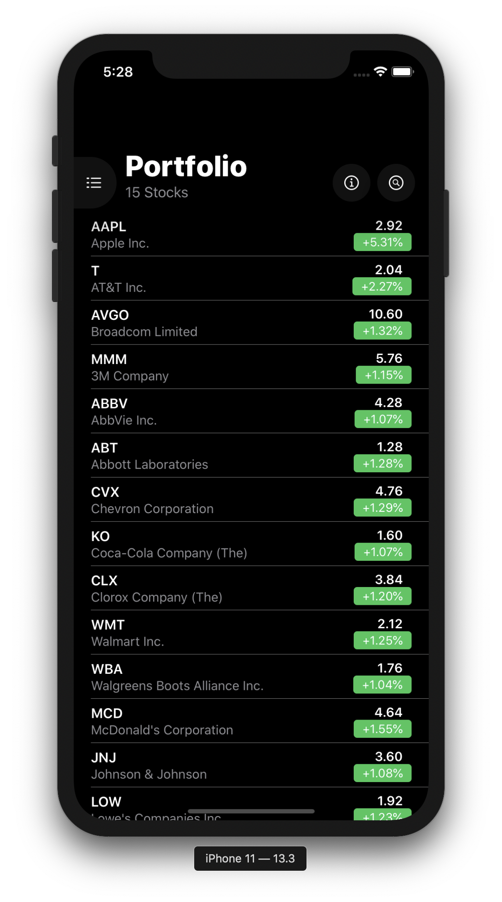 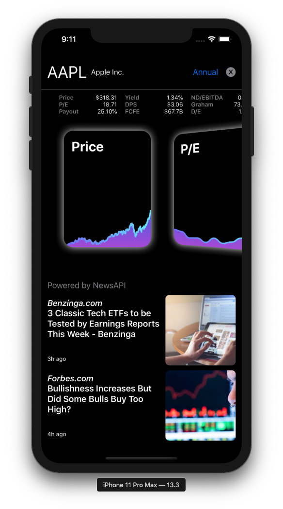 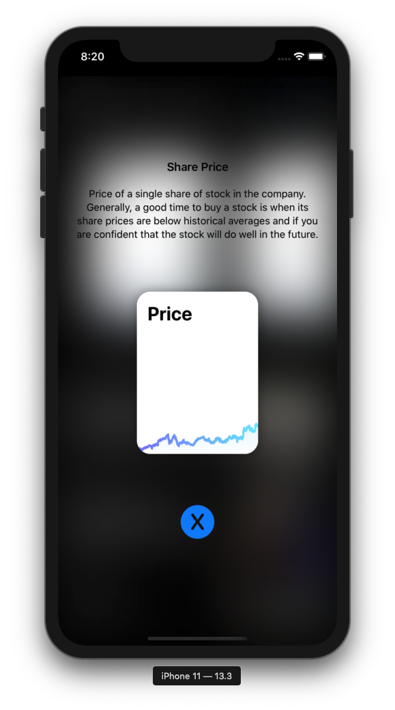 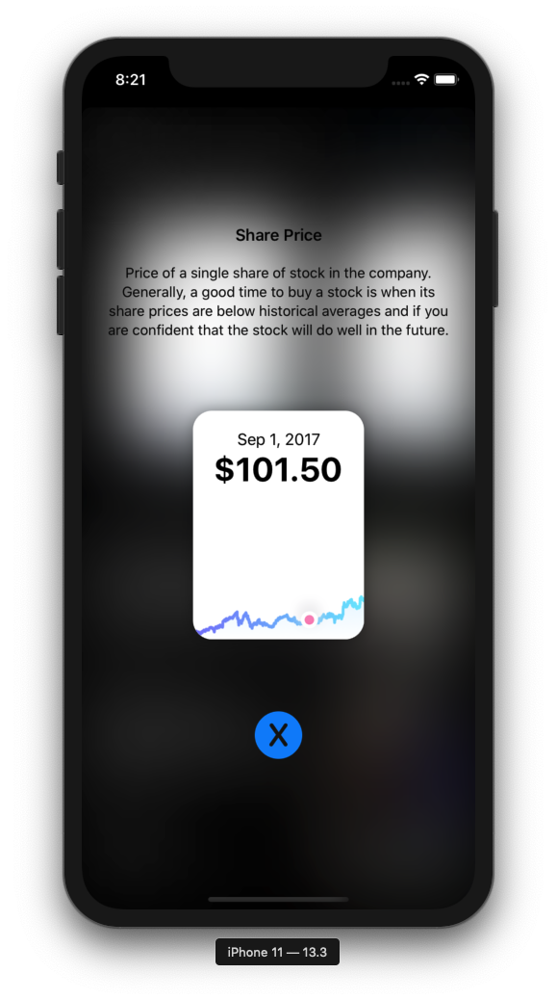 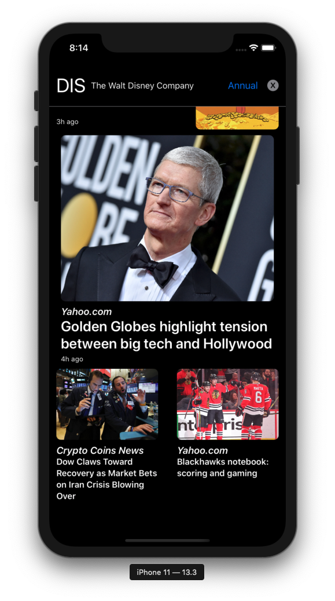 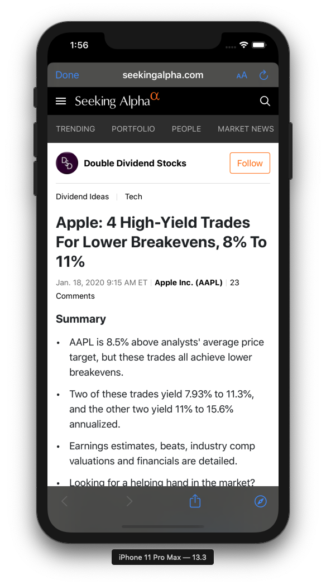 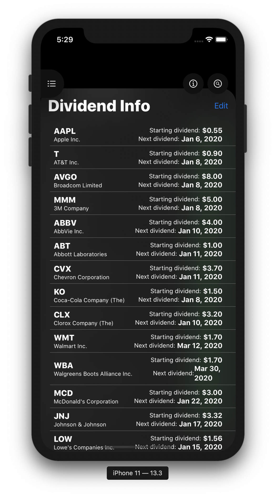 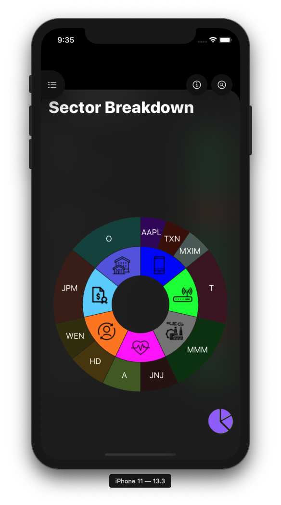 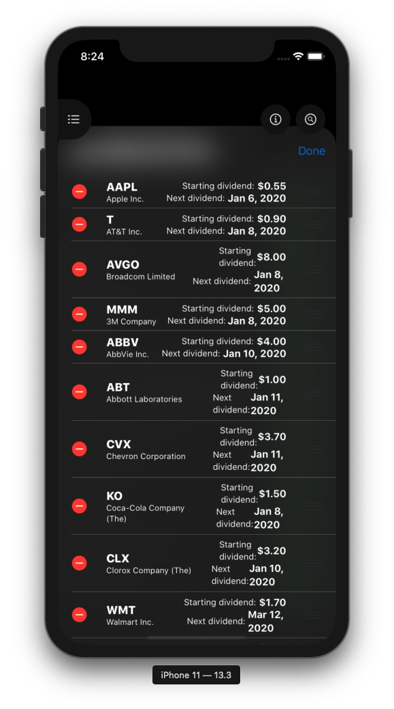 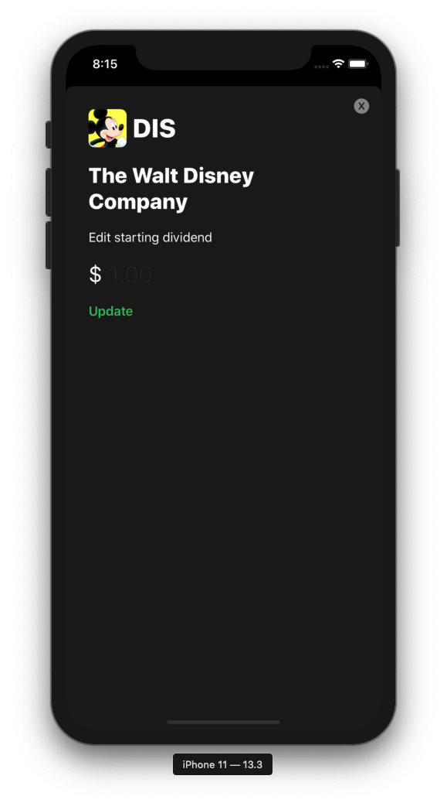 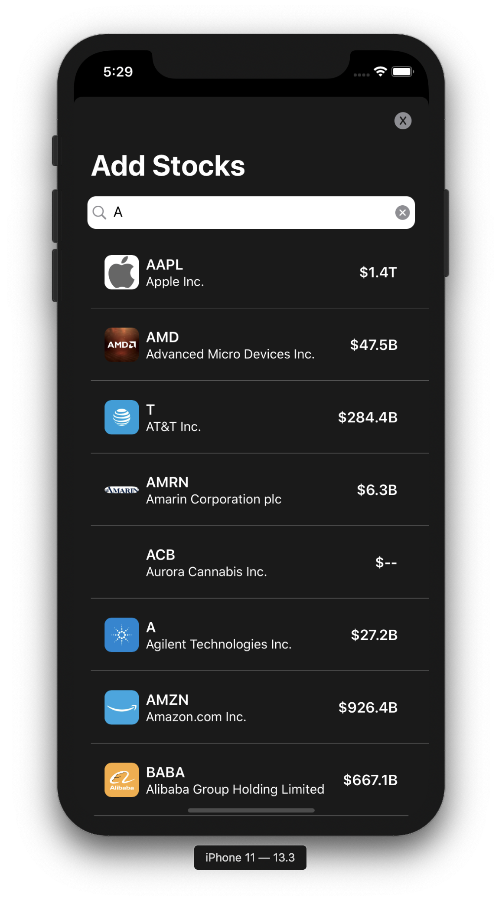 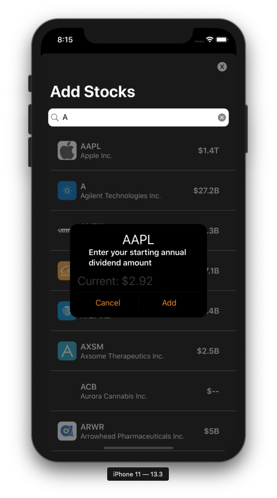 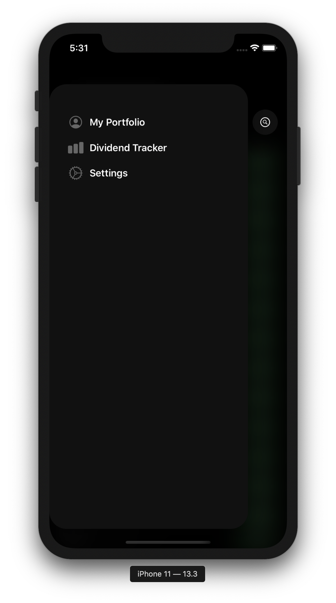 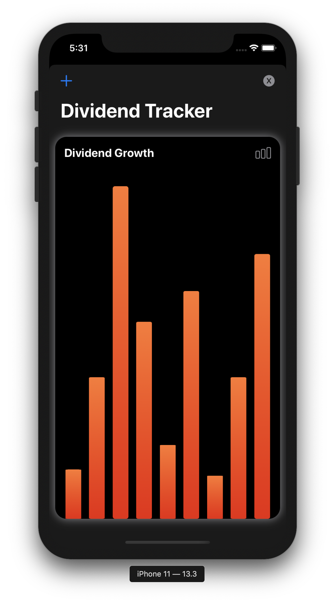 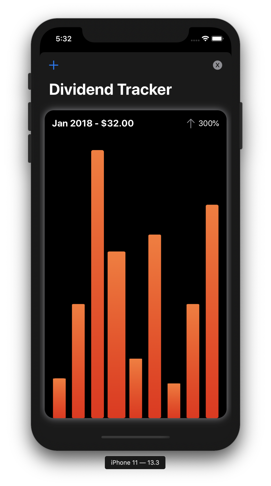 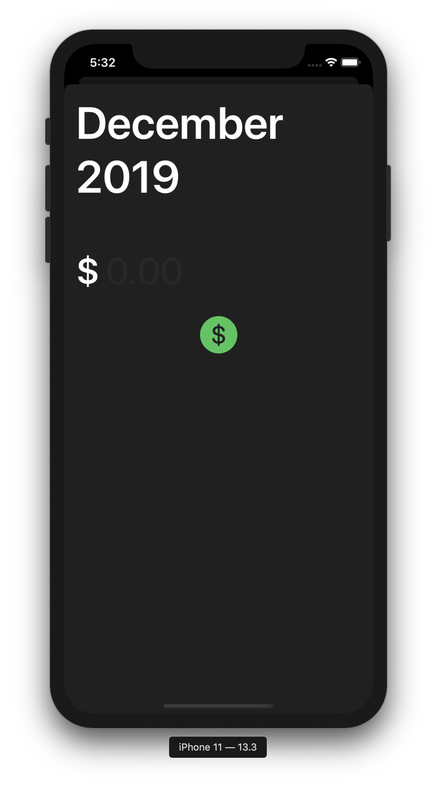 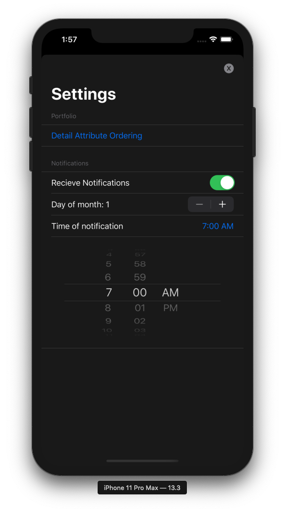 
